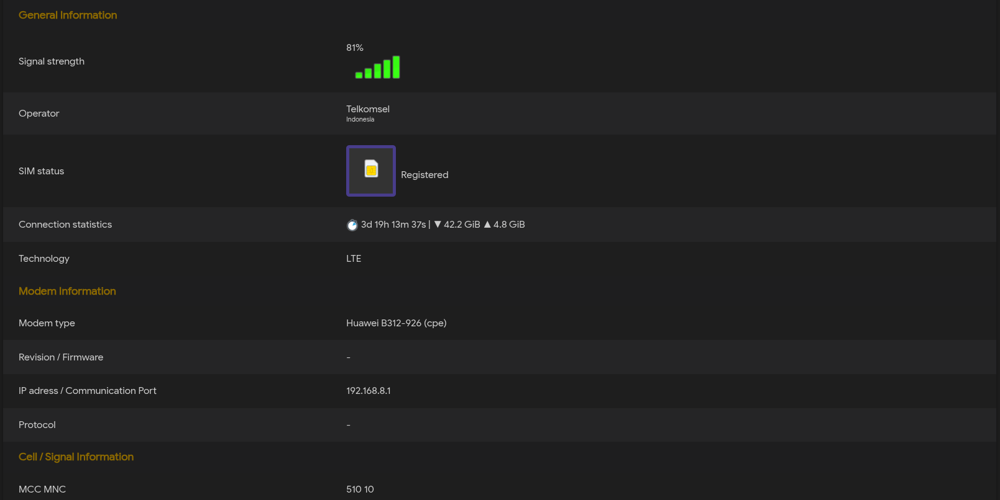

# luci-app-3ginfo-lite (Modified Version)


> [!NOTE]
> **This is a modified version** of [luci-app-3ginfo-lite](https://github.com/4IceG/luci-app-3ginfo-lite) by [4IceG](https://github.com/4IceG)
>
> **Original Project:** https://github.com/4IceG/luci-app-3ginfo-lite.git

## 🎯 What's Different in This Mod?

This modified version adds **full support for HiLink modems** (Huawei/Orbit) that use **mac-vlan connection method**:

### Screenshot


### ✨ New Features:
- ✅ **HiLink Authentication System** - Support for modems that require login (e.g., Huawei B312-926/929)
- ✅ **Multiple Authentication Methods** - SHA256 hash, base64 encoding, token-based, session-based
- ✅ **Auto-detection** - Automatically detect HiLink modem IP addresses including mac-vlan interfaces
- ✅ **Configurable Authentication Mode** - Choose between Automatic (try default credentials) or Manual only
- ✅ **Interactive Setup Wizard** - Easy setup with `/usr/share/3ginfo-lite/setup-hilink.sh`
- ✅ **Indonesian Language Support** - Full translation for Indonesian users (Bahasa Indonesia)
- ✅ **Web UI Configuration** - Configure HiLink authentication directly from LuCI interface

### 🔧 Technical Improvements:
- Multi-endpoint data extraction (device/signal, monitoring/status, net/signal-para, net/cell-info)
- Fallback mechanisms for different tag naming conventions in HiLink API
- BusyBox-compatible scripts (no grep -P dependency)
- Comprehensive error handling for authentication failures
- Support for both traditional AT command modems and HiLink web API modems

### 📱 Tested HiLink Devices:
- ✅ Huawei B312-926
- ✅ Huawei B312-929 (with mac-vlan)
- ✅ Other Huawei HiLink modems should work with similar authentication methods

## 📖 About luci-app-3ginfo-lite

Luci-app-3ginfo-lite is a simplified version of the 3ginfo project. Works with mPCI-E/M.2 and USB 3G/LTE modems, and now with HiLink modems via web API.

---

## 🚀 Quick Start for HiLink Modems

### Installation

Download the latest release IPK from [Releases page](https://github.com/alrescha79-cmd/luci-app-3ginfo-mod/releases):

```bash
# Download IPK for your architecture
wget https://github.com/alrescha79-cmd/luci-app-3ginfo-mod/releases/download/v1.0.9/luci-app-3ginfo-mod_1.0.9-20251031_all.ipk

# Install dependencies
opkg update
opkg install wget-nossl sms-tool

# Install the package
opkg install luci-app-3ginfo-mod_1.0.9-20251031_all.ipk
```

### Configuration for HiLink Modems

**Method 1: Web Interface (Recommended)**
1. Go to **Status → 3ginfo-lite → Configuration**
2. Click on **HiLink authentication** tab
3. Enter your modem details:
   - **IP address**: e.g., `192.168.8.1` or `192.168.1.1`
   - **Username**: usually `admin`
   - **Password**: your modem password
   - **Authentication mode**: Select `Automatic` or `Manual only`
4. Click **Save & Apply**

**Method 2: Interactive Setup Script**
```bash
/usr/share/3ginfo-lite/setup-hilink.sh
```

**Method 3: Command Line**
```bash
# Configure HiLink credentials
uci set 3ginfo.@3ginfo[0].hilink_ip='192.168.8.1'
uci set 3ginfo.@3ginfo[0].hilink_username='admin'
uci set 3ginfo.@3ginfo[0].hilink_password='YOUR_PASSWORD'
uci set 3ginfo.@3ginfo[0].hilink_auth_mode='manual'  # or 'auto'
uci commit 3ginfo

# Restart the service
/etc/init.d/rpcd restart
```

### Verify Connection

Check if data is being collected:
```bash
/usr/share/3ginfo-lite/3ginfo.sh
```

---

## 📋 Original Project Information

### What You Should Know
> [!IMPORTANT]
> My package will not work if you are using ModemManager.   
> Preferred version OpenWrt >= 21.02.
>
> Mój pakiet nie będzie działać jeżeli uzywasz ModemManager-a.   
> Preferowana wersja OpenWrt >= 21.02.

``` bash
Supported devices (list may not be up to date):
- ASKEY WWHC050
- BroadMobi BM806U (DLINK DWR-921 C1)
- DW5809e Dell Wireless 5809e Gobi 4G LTE Mobile Broadband Card (EM7305)
- DW5811e Snapdragon X7 LTE (EM7455B)
- DW5821e Snapdragon X20 LTE
- Fibocom FM150-AE
- Fibocom FM350-GL
- Fibocom L860-GL
- Huawei E3272/E3372/E3276
- Mikrotik R11e-LTE
- Mikrotik R11e-LTE6
- NL952-EAU in ECM mode (LTE CAT18)
- Qualcomm CDMA Technologies MSM
- Quectel EC20-E
- Quectel EC200T
- Quectel EC25
- Quectel EG06
- Quectel EG18-EA
- Quectel EM12-G
- Quectel EM160R-GL
- Quectel EP06
- Quectel RG500Q-EA
- Quectel RG502Q-EA
- Quectel RM500Q-GL
- Quectel RM500U-CNV
- Quectel RM520N-GL
- Sierra Wireless 320u
- Sierra Wireless EM7455
- Sierra Wireless EM9190
- Sierra Wireless MC7710
- SIMCOM SIM8200EA-M2
- Thales Cinterion MV31-W
- Telit LE910-EUG
- Telit LN940 (QMI) / Telit LN940 (MBIM) / HP lt4220 (MBIM) / HP lt4220 (QMI)
- Telit LN940-CP
- YUGA CLM920-NC5
- ZTE MF286
- ZTE MF286A
- ZTE MF286D
- ZTE MF286R
- ZTE MF289F
- ZTE MF28D/MF290
- ZTE MF821
 
Not tested devices (Not all data can be shown and scripts need to be corrected):
 - Fibocom FM150-AE
 - Sierra Wireless MC7710
 - Sierra Wireless EM9190
 - SIMCOM SIM8200EA-M2
 - ASKEY WWHC050
 - Mikrotik R11e-LTE
 - HiLink modems (ZTE / Alcatel)

```


###  Installation /  Instalacja

<details>
   <summary>Pokaż | Show me</summary>

#### Package dependencies for conventional modems.
Modem drivers are required for proper operation.
``` bash
opkg install kmod-usb-serial kmod-usb-serial-option sms-tool
```

#### Package dependencies for HiLink modems.
``` bash
opkg install wget-nossl sms-tool
```

The sms-tool package is available in the OpenWrt Master repository.

#### Step 1a. Install sms-tool from Master (Only the current snapshot image).
``` bash
opkg update
opkg install sms-tool
```

#### Step 1b. Download the sms-tool package and install manualy (For older stable version images).

   #### To install the sms-tool package, we need to know the architecture name for router.

<details>
   <summary>Pokaż jak znaleźć architekturę routera | Show how to find a router architecture.</summary>
   

   
   > For example, we are looking for sms-tool for Zbtlink router ZBT-WE3526.   
   
   #### Step 1.
   > We go to the page and enter the name of our router.  
   https://firmware-selector.openwrt.org/
   
   
   #### Step 2.
   > Click on the folder icon and go to the image download page.   
   
   
   
   > It should take us to a page   
   https://downloads.openwrt.org/snapshots/targets/ramips/mt7621/
   
   #### Step 3.
   > Then go into the "packages" folder at the bottom of the page.   
   https://downloads.openwrt.org/snapshots/targets/ramips/mt7621/packages/
   
   > We check what the architecture name is for our router. All packets have names ending in mipsel_24kc.ipk, so the architecture we are looking for is mipsel_24kc.
   

</details>

#### Example of sms-tool installation using the command line.
> In the link below, replace ```*architecture*``` with the architecture of your router, e.g. arm_cortex-a7_neon-vfpv4, mipsel_24kc.

``` bash
wget https://downloads.openwrt.org/snapshots/packages/*architecture*/packages/sms-tool_2022-03-21-f07699ab-1_*architecture*.ipk -O /tmp/sms-tool_2022-03-21.ipk
opkg install /tmp/sms-tool_2022-03-21.ipk
```

#### Another way is to download the package manually.
> To do this, we go to the page.   
https://downloads.openwrt.org/snapshots/packages/

> We choose our architecture, e.g. arm_cortex-a7_neon-vfpv4, mipsel_24kc.   
https://downloads.openwrt.org/snapshots/packages/mipsel_24kc/

> Go to the "packages" folder.   
https://downloads.openwrt.org/snapshots/packages/mipsel_24kc/packages/

> Looking for "sms-tool_2022-03-21". We can use search by using Ctr + F and typing "sms-tool".
Save the package to your computer for further installation on the router.

#### Step 2. Add my repository (https://github.com/4IceG/Modem-extras) to the image and follow the commands.
``` bash
opkg update
opkg install luci-app-3ginfo-lite
```

For images downloaded from eko.one.pl.
Installation procedure is similar, only there is no need to manually download the sms-tool package.
 
</details>

###  User compilation /  Kompilacja przez użytkownika

<details>
   <summary>Pokaż | Show me</summary>

``` bash
#The package can be added to Openwrt sources in two ways:

cd feeds/luci/applications/
git clone https://github.com/4IceG/luci-app-3ginfo-lite.git
cd ../../..
./scripts/feeds update -a; ./scripts/feeds install -a
make menuconfig

or e.g.

cd packages/
git clone https://github.com/4IceG/luci-app-3ginfo-lite.git
git pull
make package/symlinks
make menuconfig

#You may need to correct the file paths and the number of folders to look like this:
feeds/luci/applications/luci-app-3ginfo-lite/Makefile
or
packages/luci-app-3ginfo-lite/Makefile

#Then you can compile the packages one by one, an example command:
make V=s -j1 feeds/luci/applications/luci-app-3ginfo-lite/compile
```
</details>

###  Preview /  Podgląd


---

## 🤖 Automated Builds

This project uses GitHub Actions to automatically build IPK packages for multiple architectures:

- **x86_64** - For x86-based systems
- **aarch64** - For 64-bit ARM systems (arm64)  
- **arm** - For 32-bit ARM systems (armv7)

Every release is automatically built using OpenWrt SDK 24.10.0 and includes:
- Main package (`luci-app-3ginfo-lite`)
- Indonesian translation (`luci-i18n-3ginfo-lite-id`)
- Chinese translation (`luci-i18n-3ginfo-lite-zh-hans`)

See [workflow configuration](.github/workflows/build-ipk.yml) for details.

---

## � Changelog

### v1.0.8 (2025-10-30)
- ✅ Added HiLink authentication system with multiple methods
- ✅ Added auto-detection for HiLink modem IP addresses
- ✅ Added configurable authentication mode (Automatic/Manual)
- ✅ Added Indonesian language translation
- ✅ Added interactive setup wizard
- ✅ Fixed BusyBox compatibility issues
- ✅ Added GitHub Actions workflow for automated builds
- ✅ Updated branding and links to mod repository

---

## 🙏 Credits & Thanks

### Modified Version
- **Modified by:** [alrescha79-cmd](https://github.com/alrescha79-cmd)
- **Repository:** https://github.com/alrescha79-cmd/luci-app-3ginfo-mod

### Original Project
- **Original Author:** [4IceG](https://github.com/4IceG)
- **Original Project:** [luci-app-3ginfo-lite](https://github.com/4IceG/luci-app-3ginfo-lite)
- **Based on:** [modemdata](https://github.com/obsy/modemdata) by [obsy (Cezary Jackiewicz)](https://github.com/obsy)

Special thanks to the original developers for creating this excellent modem information tool!

---

## 📄 License

This project inherits the GNU General Public License v3.0 from the original luci-app-3ginfo-lite project.

See [LICENSE](luci-app-3ginfo-lite/LICENSE) file for details.
